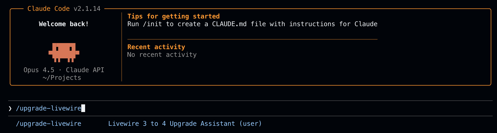

# Livewire 3 to 4 Upgrade Guide

Comprehensive upgrade guide and tooling for migrating Laravel Livewire from version 3 to version 4. This package provides step-by-step instructions, code patterns, and a `/upgrade-livewire` slash command for Claude Code.

<center>

</center>

## Features

- **Step-by-Step Migration** - Complete guide for applications and packages
- **Breaking Changes Reference** - All deprecations and behavior changes
- **Code Patterns** - Before/after examples for common patterns
- **Slash Command** - `/upgrade-livewire` command for Claude Code assistance
- **Testing Guide** - Verify your upgrade with comprehensive testing
- **Troubleshooting** - Solutions for common upgrade issues

## What's Included

```text
claude-upgrade-livewire/
├── README.md                      # This file
├── install.sh                     # One-command installer
├── upgrade-livewire.md            # /upgrade-livewire slash command
├── livewire-upgrade-guide.md      # Complete upgrade reference
├── docs/                          # Detailed documentation
│   ├── 01-overview/               # What's new, compatibility
│   ├── 02-breaking-changes/       # Deprecations, removed features
│   ├── 03-migration-guide/        # Step-by-step upgrade
│   ├── 04-patterns/               # Code migration patterns
│   └── 05-testing/                # Testing your upgrade
└── LICENSE
```

## Quick Install

### One-Line Install

```bash
curl -fsSL https://raw.githubusercontent.com/nasrulhazim/claude-upgrade-livewire/main/install.sh | bash
```

### Manual Install

1. **Clone the repository:**

   ```bash
   git clone https://github.com/nasrulhazim/claude-upgrade-livewire.git
   cd claude-upgrade-livewire
   ```

2. **Run the installer:**

   ```bash
   chmod +x install.sh
   ./install.sh
   ```

3. **Verify installation:**

   ```bash
   ls -la ~/.claude/
   # Should see: livewire-upgrade-guide.md, commands/upgrade-livewire.md
   ```

## What Gets Installed

The installer copies these files to your `~/.claude` directory:

| File | Location | Purpose |
|------|----------|---------|
| `livewire-upgrade-guide.md` | `~/.claude/` | Complete upgrade reference |
| `upgrade-livewire.md` | `~/.claude/commands/` | `/upgrade-livewire` slash command |

## Usage

### Using the Slash Command

In any project with Claude Code:

```bash
/upgrade-livewire
```

Claude will:

1. Assess your Livewire components
2. Identify deprecated patterns
3. Guide you through the upgrade
4. Update code as needed
5. Verify with tests

### Quick Upgrade (Manual)

```bash
# 1. Update dependency
composer require livewire/livewire:^4.0

# 2. Clear caches
php artisan optimize:clear

# 3. Run tests
composer test
```

## Version Compatibility

| Livewire | PHP | Laravel |
|----------|-----|---------|
| 4.x | 8.1+ | 10.x, 11.x, 12.x |
| 3.x | 8.1+ | 10.x, 11.x, 12.x |

## Backward Compatible Features

These Livewire 3 patterns work unchanged in Livewire 4:

```php
// Attributes
#[Layout('layouts.app')]
#[Url]
#[Validate('required')]
#[Computed]
#[On('event-name')]

// Event dispatching
$this->dispatch('event-name');

// Validation
protected array $rules = ['name' => 'required'];

// URL state
protected $queryString = ['search' => ['except' => '']];

// Traits
use WithPagination;
use WithFileUploads;
```

### Blade Directives (Unchanged)

```blade
wire:model
wire:model.live
wire:model.blur
wire:click
wire:navigate
wire:confirm
wire:loading
```

## Deprecated Patterns

These patterns still work but should be updated:

```php
// Before (deprecated)
$this->emit('event');
$this->emitTo('component', 'event');

// After (recommended)
$this->dispatch('event');
$this->dispatch('event')->to('component');
```

## Routing Changes (Livewire 4)

Full-page component routing now uses `Route::livewire()`:

```php
// Livewire 3
Route::get('/dashboard', Dashboard::class);

// Livewire 4 (recommended)
Route::livewire('/dashboard', Dashboard::class);

// For packages using Livewire::addNamespace(), use string component names:
Route::livewire('/dashboard', 'my-package::dashboard');
```

## Documentation Structure

```text
docs/
├── 01-overview/
│   ├── 01-whats-new.md            # New features in Livewire 4
│   ├── 02-compatibility.md        # Version requirements
│   └── 03-upgrade-assessment.md   # Assess your codebase
├── 02-breaking-changes/
│   ├── 01-deprecations.md         # Deprecated features
│   ├── 02-removed-features.md     # Removed features
│   └── 03-behavior-changes.md     # Changed behaviors
├── 03-migration-guide/
│   ├── 01-getting-started.md      # Prerequisites
│   ├── 02-application-upgrade.md  # App upgrade steps
│   ├── 03-package-upgrade.md      # Package upgrade steps
│   └── 04-troubleshooting.md      # Common issues
├── 04-patterns/
│   ├── 01-event-patterns.md       # Event migration
│   ├── 02-validation-patterns.md  # Validation patterns
│   └── 03-state-management.md     # State management
└── 05-testing/
    ├── 01-unit-testing.md         # Component tests
    └── 02-integration-testing.md  # Integration tests
```

## Requirements

- **Claude Code** - Latest version
- **PHP** - 8.1 or higher
- **Laravel** - 10.x, 11.x, or 12.x
- **Livewire** - Currently on 3.x

## Contributing

Contributions welcome! Please:

1. Fork the repository
2. Create a feature branch
3. Follow the documentation standards
4. Submit a pull request

## License

MIT License - see LICENSE file for details

## Support

- **Issues**: [GitHub Issues](https://github.com/nasrulhazim/claude-upgrade-livewire/issues)
- **Discussions**: [GitHub Discussions](https://github.com/nasrulhazim/claude-upgrade-livewire/discussions)

## Resources

- [Livewire Official Documentation](https://livewire.laravel.com/docs)
- [Livewire GitHub Repository](https://github.com/livewire/livewire)
- [Laravel Documentation](https://laravel.com/docs)

## Changelog

### v1.0.0 (2026-01-21)

- Initial release
- Complete upgrade documentation
- `/upgrade-livewire` slash command
- Migration patterns and examples
- Testing documentation

---

**Made for the Laravel and Claude Code community**
